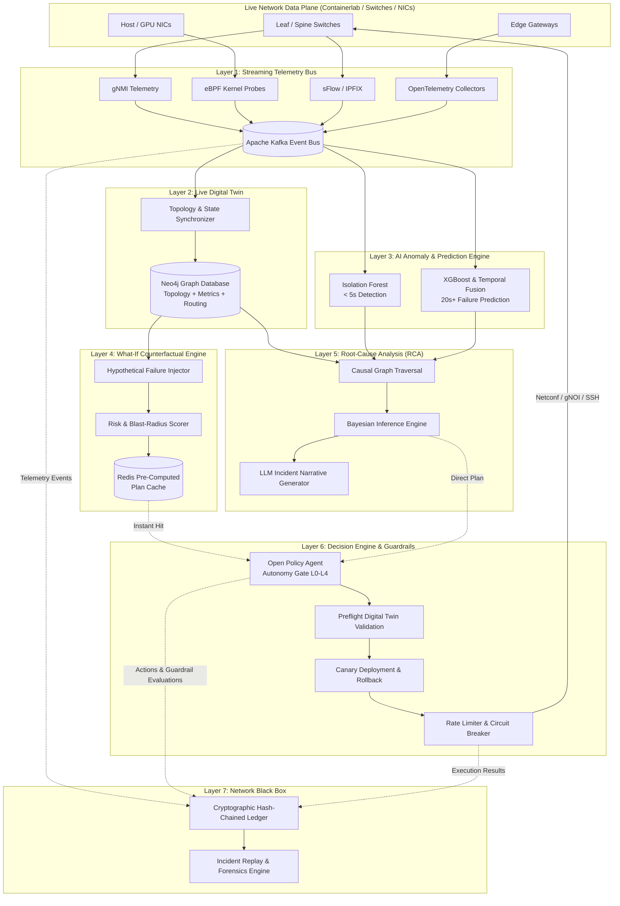

# Aexyron System Architecture: Deep Dive

This document details the seven-layer architecture of **Aexyron**, an autonomous, digital-twin-driven network operations system engineered for enterprise networks and high-performance AI/GPU cluster fabrics.

---

## 1. High-Level Architectural Overview

Aexyron eliminates the latency of human intervention in network operations centers (NOCs) by creating a continuous, closed-loop control system:
1. **Perceive**: Collect multi-modal telemetry via gNMI, eBPF, sFlow, and OpenTelemetry.
2. **Model**: Maintain a live, graph-based digital twin (Neo4j) refreshed every 30 seconds.
3. **Detect & Predict**: Identify anomalies in < 5 seconds and forecast failures 20+ seconds ahead.
4. **Anticipate**: Continuously run counterfactual "What-If" simulations and pre-compute recovery plans in Redis.
5. **Diagnose**: Pinpoint fault origins via causal Bayesian inference and generate LLM incident narratives.
6. **Act with Guardrails**: Execute automated remediations (L0–L4 autonomy) governed by Open Policy Agent (OPA), canaries, and circuit breakers.
7. **Record & Replay**: Log every telemetry tick, hypothesis, and command to an append-only, SHA-256 hash-chained Black Box.

---

## 2. Seven Architectural Layers Breakdown

### Layer 1: Streaming Telemetry
- **Protocols Supported**:
  - `gNMI` (gRPC Network Management Interface) for high-frequency switch counter streaming (interface packets, drops, CRC errors, optical transceiver power).
  - `eBPF` (Extended Berkeley Packet Filter) on compute/storage hosts for kernel-level socket drop monitoring, TCP RTT distribution, and retransmissions.
  - `sFlow / IPFIX` for flow-level visibility into traffic matrix and ECMP hash distribution.
  - `OpenTelemetry (OTel)` for cross-layer distributed tracing across control plane services.
- **Ingestion Backbone**: Apache Kafka partitioned by device ID and interface hash, guaranteeing ordered ingestion at 100k+ events/sec with sub-millisecond serialization latency using Protocol Buffers / Avro.

### Layer 2: Live Digital Twin
- **Storage Engine**: Neo4j Graph Database.
- **Synchronization Period**: 30 seconds for complete topological reconciliation; sub-second incremental updates for BGP neighbor state shifts or link down events.
- **Graph Schema**:
  - **Nodes**: `Device` (Spine, Leaf, Host, Gateway), `Interface`, `VLAN`, `BGP_Peer`, `VRF`, `RoutePrefix`.
  - **Relationships**: `CONNECTED_TO`, `PEERS_WITH`, `ROUTES_VIA`, `MEMBER_OF`, `HOSTED_ON`.
  - **Properties**: Bandwidth capacity, MTU, operational status, queue buffer occupancy, packet drop rates, ECMP weights.

### Layer 3: AI Anomaly & Prediction Engine
- **Fast-Path Anomaly Detection (< 5s)**:
  - Unsupervised **Isolation Forests** operating on sliding statistical windows (moving average, variance, EWMA, packet drop rate deltas).
  - Identifies silent packet drops, microburst queue build-ups, and optical power degradations before hard link failure.
- **Predictive Failure Horizon (20s+ ahead)**:
  - **XGBoost** and **Temporal Fusion Transformers (TFT)** trained on multi-horizon time-series data.
  - Predicts impending transceivers blowout, CRC error cascades, and buffer exhaustion caused by synchronized incast traffic in distributed GPU training jobs (AllReduce / NCCL).

### Layer 4: What-If Counterfactual Reasoning Engine
- **Concept**: Rather than calculating recovery paths *after* a catastrophic failure occurs, Aexyron continuously explores hypothetical "what-if" branch states in the digital twin.
- **Workflow**:
  1. Identifies Top-K critical links (high centrality, heavy traffic load).
  2. Simulates instantaneous cut or silent degradation of that link.
  3. Computes the optimal reroute, traffic de-prioritization, or BGP weight shift.
  4. Calculates the residual risk and blast-radius score across downstream services.
  5. Caches the verified recovery recipe in **Redis** with a 60-second TTL.
- **Latency Advantage**: When an anomaly triggers, the system matches the fault signature to the pre-computed plan in Redis, reducing planning latency to **< 2 milliseconds**.

### Layer 5: Root-Cause Analysis (RCA) & Narrative Generation
- **Causal Graph Traversal**:
  - Translates active alerts and topological dependencies into a Directed Acyclic Graph (DAG) of potential failure origins.
- **Bayesian Inference**:
  - Computes posterior probabilities: $P(\text{Root Cause } R_i \mid \text{Observed Symptoms } S)$.
  - Eliminates alert storms (e.g., distinguishing a true spine switch ASIC failure from 48 downstream leaf link-loss alerts).
- **LLM Narrative Generator**:
  - Generates clear, structured incident explanations for NOC engineers:
    - *Executive Summary*: "Spine-02 transceiver link flap triggered ECMP polarization and downstream buffer drops on Leaf-01."
    - *Evidence Chain*: Chronological sequence of anomalies and causal weights.
    - *Remediation Rationale*: Why the specific recovery route was chosen.

### Layer 6: Decision Engine & Guardrails
- **Autonomy Levels**:
  - **L0 (Alert Only)**: System flags root causes and displays recommended remediation; human must execute.
  - **L1 (Operator Assisted)**: System produces 1-click execution plans with impact simulations.
  - **L2 (Bounded Automation)**: System auto-executes low-risk actions (e.g., clearing interface counters, adjusting BGP metric weights within 10%).
  - **L3 (Conditional Autonomy)**: System auto-executes reroutes, drains, and interface shutdowns within verified blast-radius thresholds; alerts human supervisor.
  - **L4 (Full Autonomy)**: System operates independently across all validated operational playbooks with automated canary validation and rollback.
- **Policy Enforcement**:
  - **Open Policy Agent (OPA)** policies written in Rego enforce invariant constraints (e.g., "Never drain more than 25% of spine capacity simultaneously", "Production GPU training clusters must maintain redundant paths").
- **Safety Mechanisms**:
  - **Preflight Twin Simulation**: The candidate config change is applied to an in-memory clone of the digital twin to check for loops, blackholes, or partition risks.
  - **Canary Rollout**: Remediations shift 5% of traffic before full deployment.
  - **Automatic Rollback**: If telemetry shows degradation within 10 seconds of remediation, config is instantly restored to the previous checkpoint.
  - **Circuit Breaker**: Halts automated remediation if > 3 actions occur within 60 seconds across the same failure domain.

### Layer 7: Network Black Box
- **Design Philosophy**: Modeled after aerospace flight data recorders.
- **Cryptographic Immutability**:
  - Every event (telemetry sample, anomaly alert, counterfactual evaluation, OPA decision, remediation command) is serialized into an append-only log.
  - Entries are linked via SHA-256 hash chains ($H_n = \text{SHA256}(H_{n-1} \parallel \text{Event}_n)$), preventing retrospective tampering or audit suppression.
- **Forensic Replay**:
  - Deterministic replay tool allows engineers and auditors to step through an incident second-by-second, visualizing the state of the network, the AI reasoning process, and the exact remediation timeline.

---

## 3. Communication Protocols and Data Flow Specifications

| Interface | Source | Destination | Protocol | Target Latency |
| :--- | :--- | :--- | :--- | :--- |
| Telemetry Ingestion | Network Fabric | Streaming Bus | gNMI / eBPF / sFlow | < 100 ms |
| Bus Ingestion | Streaming Bus | AI Engine / Digital Twin | Kafka / Avro | < 50 ms |
| Twin Graph Sync | Digital Twin Synchronizer | Neo4j | Bolt Protocol | < 30 s full, < 1 s delta |
| Anomaly Trigger | Isolation Forest | RCA Engine | In-Memory / Kafka | < 5 s |
| Failure Forecast | Temporal Fusion Transformer | What-If Engine | In-Memory / Kafka | 20+ s ahead |
| Plan Cache Lookup | Decision Engine | Redis | RESP / In-Memory | < 5 ms |
| Guardrail Check | Decision Engine | OPA Daemon | HTTP REST / gRPC | < 10 ms |
| Action Execution | Decision Engine | Network Fabric | gNOI / Netconf / SSH | < 2 s |
| Black Box Commit | All Components | Black Box Storage | Hash-Chained Append Log | < 5 ms |
