# 13-Week Implementation Roadmap: Aexyron

This roadmap outlines the week-by-week engineering milestones, validation criteria, and academic paper checkpoints for the 13-week development cycle of the **Aexyron** Self-Healing AI Network.

---

## 🗓️ High-Level Milestone Overview

```mermaid
gantt
    title Aexyron 13-Week Implementation Roadmap
    dateFormat  WW
    axisFormat W%W
    
    section Phase 1: Foundation & Telemetry
    Containerlab & Topology Setup      :w01, 01, 2w
    gNMI, eBPF & Kafka Pipeline       :w02, after w01, 2w
    
    section Phase 2: Live Digital Twin
    Neo4j Graph Schema & Sync         :w03, after w02, 2w
    State Reconciliation Engine       :w04, after w03, 1w
    
    section Phase 3: AI Engine
    Isolation Forest (<5s Anomaly)    :w05, after w04, 1w
    XGBoost & TFT (20s+ Predictor)    :w06, after w05, 2w
    
    section Phase 4: What-If Engine
    Counterfactual Simulator          :w07, after w06, 1w
    Redis Plan Cache & Risk Scorer    :w08, after w07, 1w
    
    section Phase 5: RCA & Guardrails
    Bayesian Causal Graph Traversal   :w09, after w08, 1w
    OPA Policies & L0-L4 Autonomy     :w10, after w09, 1w
    
    section Phase 6: Black Box & Replay
    Hash-Chained Audit Ledger         :w11, after w10, 1w
    Forensic Replay & CLI Tool        :w12, after w11, 1w
    
    section Phase 7: Benchmarks & Paper
    Containerlab MTTR Benchmarks      :w13, after w12, 1w
    Academic Paper Draft (NSDI/SIGCOMM):w13, after w12, 1w
```

---

## 📅 Detailed Weekly Breakdown

### Phase 1: Testbed & Streaming Telemetry Pipeline (Weeks 1–3)
- **Week 1: Containerlab Testbed & Virtual Fabric Scaffolding**
  - Implement 3-tier Spine-Leaf Clos topology in Containerlab (FRRouting / Arista cEOS / SONiC).
  - Setup traffic generators (iperf3, MoonGen, packet blasting for RoCEv2 simulation).
  - Implement synthetic failure injection harnesses (link cuts, MTU mismatches, delay).
  - *Exit Gate*: Fully automated spin-up of multi-switch topology via `clab deploy`.

- **Week 2: Streaming Telemetry Ingestion (gNMI & eBPF)**
  - Configure switch gNMI streaming for interface counters, optical power, and queue depths.
  - Implement eBPF kernel probes for host-side TCP RTT and packet drop tracing.
  - Setup sFlow collector for ECMP hash distribution and flow table visibility.
  - *Exit Gate*: Telemetry streams flowing reliably into local consumers at > 50,000 metrics/sec.

- **Week 3: High-Throughput Kafka Event Bus & Schemas**
  - Deploy Kafka cluster with Zookeeper/KRaft in Docker Compose.
  - Define Protocol Buffers / Avro schemas for `telemetry-raw`, `telemetry-aggregated`, and `events`.
  - Implement high-throughput Kafka producer with batching and backpressure control.
  - *Exit Gate*: Sub-10ms end-to-end telemetry transport from switch agent to Kafka partition.

---

### Phase 2: Live Digital Twin (Weeks 4–5)
- **Week 4: Neo4j Network Graph Model**
  - Design Neo4j graph schema for switches, ports, links, VLANs, and BGP routing sessions.
  - Implement initial topology ingestion via LLDP/BGP discovery scripts.
  - Create Cypher query library for shortest-path calculation, bottleneck detection, and ECMP group traversal.
  - *Exit Gate*: Graph visualization mirroring active Containerlab fabric.

- **Week 5: Continuous State Synchronization (30-second Reconciliation)**
  - Implement real-time delta synchronizer consuming from Kafka bus.
  - Build 30-second full reconciliation worker to detect topology drifts and configuration drift.
  - Implement in-memory twin clone mechanism for sandbox simulation.
  - *Exit Gate*: Graph accurately reflects topology changes within 1 second for link downs and 30 seconds for complete state.

---

### Phase 3: AI Anomaly & Prediction Engine (Weeks 6–7)
- **Week 6: Unsupervised Fast Anomaly Detection (< 5s Latency)**
  - Implement rolling-window feature engineering (EWMA, variance, drop delta, optical power shift).
  - Train and optimize lightweight **Isolation Forest** models for streaming switch metrics.
  - Integrate threshold evaluation pipeline emitting structured anomaly alerts to Kafka.
  - *Exit Gate*: Detection of injected packet loss and link flaps in < 5 seconds with < 5% false-positive rate.

- **Week 7: Multi-Horizon Failure Forecasting (20s+ Ahead)**
  - Train **XGBoost** and **Temporal Fusion Transformer (TFT)** models on synthetic degradation sequences.
  - Forecast impending failures: CRC error cascades, optic degradation, and buffer exhaustion during GPU incast.
  - Evaluate forecast horizon and precision ($F_1$-score > 0.90 at 20s lead time).
  - *Exit Gate*: Predictive alerts emitted 20–45 seconds prior to catastrophic link or buffer drops.

---

### Phase 4: What-If Counterfactual Reasoning Engine (Weeks 8–9)
- **Week 8: Counterfactual Simulator & Risk Scorer**
  - Implement counterfactual engine evaluating Top-K link and node failure permutations on twin.
  - Calculate blast radius: impacted prefixes, alternative ECMP capacities, and latency inflation.
  - Compute composite risk scores for candidate failover configurations.
  - *Exit Gate*: Automated generation of verified candidate failover plans for top 10 failure scenarios.

- **Week 9: Pre-Computed Plan Caching in Redis**
  - Deploy Redis cache for storing structured remediation recipes keyed by fault signature hash.
  - Implement TTL and invalidation logic triggered on topology drift.
  - Benchmark retrieval latency: ensure plan lookup is < 2 milliseconds.
  - *Exit Gate*: Instant cache hits when simulated failures occur on critical paths.

---

### Phase 5: Root-Cause Analysis & Decision Guardrails (Weeks 10–11)
- **Week 10: Bayesian Causal Graph Traversal & Narrative Generation**
  - Implement causal DAG traversal mapping symptoms to primary switch/transceiver failures.
  - Build Bayesian inference engine calculating posterior fault probabilities.
  - Integrate LLM agent for generating structured, human-readable incident explanations.
  - *Exit Gate*: Accurate root-cause isolation amid 1,000+ simultaneous symptomatic alerts.

- **Week 11: Open Policy Agent (OPA) Guardrails & Autonomy Levels L0–L4**
  - Write Rego policies enforcing safety invariants (max drained capacity, route preservation).
  - Implement L0–L4 autonomy gatekeeper (Alert Only -> Operator Assisted -> Bounded -> Conditional -> Full).
  - Implement canary deployment, 10-second metric verification, and automated rollback controller.
  - Implement circuit breakers to stop cascading auto-actions.
  - *Exit Gate*: OPA successfully blocks unsafe remediation plans and triggers auto-rollback on simulated post-action degradation.

---

### Phase 6: Network Black Box & Forensics (Week 12)
- **Week 12: Cryptographic Hash-Chained Event Ledger & Replay Engine**
  - Implement append-only ledger computing SHA-256 chain links for every system event.
  - Implement tamper-detection verification tool.
  - Build deterministic CLI and Web visualizer for incident replay (scrubbing forward/backward in time).
  - *Exit Gate*: Full replay of a multi-switch incident showing telemetry, AI predictions, and remediation events.

---

### Phase 7: Evaluation, Benchmarks & Paper Draft (Week 13)
- **Week 13: Controlled Benchmarking & Academic Publication Draft**
  - Run rigorous 100-trial benchmark suite in Containerlab comparing Aexyron against human operator baseline.
  - Verify metrics: MTTR < 15s (vs ~4 min manual), FPR < 5%, Recovery Success > 90%.
  - Finalize research paper draft targeting **NSDI / SIGCOMM / CoNEXT**.
  - Package open-source release with reproducible Docker and Containerlab recipes.
  - *Exit Gate*: Complete benchmark dataset, reproducibility suite, and camera-ready paper manuscript.
