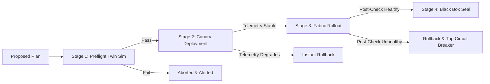

# Safety Analysis & Decision Guardrails Specification

Autonomous network remediation in production AI/GPU clusters and datacenter fabrics introduces catastrophic operational risks if left unconstrained. A single erroneous automated route withdrawal or switch reload can cause cross-rack partitions, sever active NCCL distributed training rings, and trigger millions of dollars in downtime.

**Aexyron** treats safety as a first-class engineering invariant through a multi-tiered defense-in-depth model combining formal policy evaluation, autonomy gates, sandbox simulation, canary verification, and hardware circuit breakers.

---

## 1. Five Autonomy Levels (L0 to L4)

Aexyron implements a graded operational autonomy framework modeled on SAE autonomy standards:

| Level | Designation | Execution Mode | Human Involvement | Safe Failure Mode |
| :--- | :--- | :--- | :--- | :--- |
| **L0** | Alert Only | Passive Monitoring | Operator executes all remediations | System displays diagnosis only |
| **L1** | Operator Assisted | Recommended Plan | Operator clicks "Approve" after review | Auto-expires after 60s if unapproved |
| **L2** | Bounded Autonomous | Low-Risk Auto-Fix | Operator notified post-execution | Hard-bounded to non-disruptive actions |
| **L3** | Conditional Autonomous | High-Impact Auto-Fix | Operator alerted; 15s pause override | Strict blast-radius limit (< 15% fabric) |
| **L4** | Fully Autonomous | Closed-Loop Remediation | Zero-touch; forensic audit via Black Box | Automatic canary + instant rollback |

---

## 2. Policy Enforcement with Open Policy Agent (OPA)

All candidate actions proposed by the AI Engine, What-If Engine, or RCA system must pass through the **OPA Decision Gate** prior to dispatch.

### Core Policy Invariants (Rego)
1. **Draining Capacity Cap**: An automated action may never drain more than 25% of total spine capacity simultaneously.
2. **GPU Cluster Fabric Preservation**: Active RoCEv2 / InfiniBand GPU worker nodes must retain at least two independent, non-overlapping ECMP paths to the parameter server / spine fabric.
3. **Flap Damping**: An interface that has flapped more than twice in 10 minutes cannot be automatically restored without manual override.
4. **Maintenance Window Overrides**: Critical production periods can lock autonomy level down to L0 or L1 dynamically.

### Example Rego Policy (`guardrails.rego`)
```rego
package aexyron.guardrails

default allow = false

# Allow execution if within blast radius limit and no circuit breaker tripped
allow {
    not circuit_breaker_active
    blast_radius_safe
    redundant_paths_preserved
    rate_limit_ok
}

blast_radius_safe {
    input.candidate_action.drained_capacity_ratio <= 0.25
    input.candidate_action.affected_gpu_nodes == 0
}

redundant_paths_preserved {
    input.candidate_action.min_remaining_ecmp_paths >= 2
}

rate_limit_ok {
    input.recent_actions_count_60s < 3
}

circuit_breaker_active {
    data.system_state.circuit_breaker_tripped == true
}
```

---

## 3. Four-Stage Execution Pipeline

Every permitted action undergoes a strict four-stage execution pipeline:



### Stage 1: Preflight Digital Twin Simulation
- Before issuing commands to physical or virtual switches, the candidate change is applied to an in-memory clone of the Neo4j digital twin.
- Pathfinding algorithms (Dijkstra / Yen's K-Shortest Paths) verify:
  - No routing loops are created ($O(V+E)$ cycle detection).
  - Reachability between all VPCs and GPU endpoints remains 100%.
  - No surviving link experiences traffic projected to exceed 85% bandwidth utilization.

### Stage 2: Canary Deployment (Traffic Shifting)
- Instead of cutting or redirecting 100% of traffic instantaneously:
  - BGP metric weights or ECMP hash weights are shifted to divert a 5% canary sample.
  - Telemetry is monitored for 5 to 10 seconds:
    - Packet drop delta $\le 0.01\%$.
    - TCP retransmissions remain nominal.
    - Optical power and queue buffer occupancy remain stable.

### Stage 3: Fabric Rollout & Continuous Verification
- Once the canary stage passes, the remediation is phased to 100% of the target scope.
- Continuous post-remediation health telemetry runs for 60 seconds.

### Stage 4: Automated Instant Rollback
- If at any point during Stage 2 or 3 an SLA violation occurs (packet drop surge > 1%, RTT inflation > 30%, BGP state down):
  - The controller dispatches pre-cached **inverse transaction commands**.
  - The network is reverted to the baseline configuration in **< 1.5 seconds**.
  - An emergency alert is routed to on-call NOC engineers.

---

## 4. Rate Limiting & Circuit Breakers

To guard against cascading remediation storms (where an AI action triggers a secondary anomaly, which triggers another action, compounding into complete fabric collapse):
- **Rate Limiter**: Maximum 3 automated remediation actions per failure domain in any rolling 60-second window.
- **Global Circuit Breaker**: If two consecutive automated rollbacks occur, the entire subsystem drops autonomy to **L0 (Alert Only)** and locks automated execution until human re-certification.
- **Fail-Safe Default**: In the event of network partition between the Aexyron controller and the data plane, switches retain their last verified running configuration; no speculative changes are committed.
